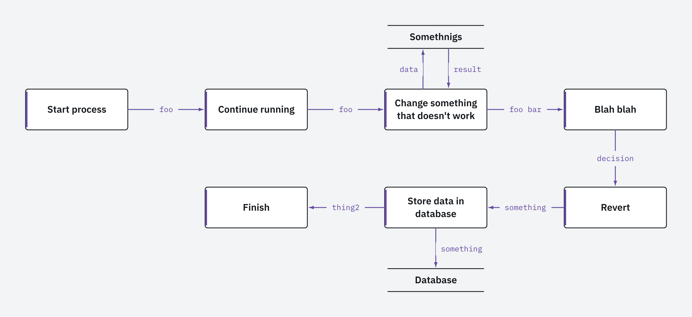

# dfd

Turn condensed text into data-flow diagrams (SVG/PNG).


That picture is this text ([examples/original.dfd](examples/original.dfd)):

```
[Start process]
> foo
[Continue running]
> foo
[Change something that doesn't work]
    > data
    < result
    |Somethnigs|
> foo bar
[Blah blah]
> decision
[Revert]
> something
[Store data in database]
    > something
    |Database|
> thing2
[Finish]
```

rendered with:

```
dfd examples/original.dfd -o examples/original.png
```

Other ways to run it:

```
dfd flow.dfd -o flow.svg
dfd flow.dfd              # writes flow.svg next to the input
cat flow.dfd | dfd > flow.svg
```

## Themes

`--theme plex` swaps the hand-drawn look for a cool-grey canvas, hairline
boxes with a violet accent spine, and monospace arrow labels centred on
their connector:



```
dfd --theme plex examples/original.dfd -o out.png
```

Themes change measurement as well as paint, so the two layouts differ:
plex sizes column gaps to fit a whole label plus a visible stub of arrow
either side, and never auto-wraps a label sitting on a line. Use explicit
line breaks to shorten one. IBM Plex Sans and Mono are embedded in the
binary (SIL Open Font License 1.1, see `internal/typeface/fonts/OFL.txt`),
so PNG output is identical everywhere with no fonts installed.

## Syntax

- `[Text]` — process box; document order is the flow
- `> label` / `< label` — arrows, label optional; before a process it is
  the flow arrow into it, before a `|store|` line it is that store's
  send (`>`) / return (`<`) arrow
- `{Text}` — external entity, a source or sink outside the system; it
  takes a slot in the flow like a process
- `|Text|` — datastore (two horizontal lines) attached to the nearest
  preceding process
- `Alias := Label` inside any bracket declares a shorthand; the bare
  alias then stands for that label, as in `|R := Registration|` then
  `|R|`. Both draw the full label
- `#` — comment; blank lines and indentation are cosmetic
- `\]`, `\|`, `\}`, `\:=`, `\\` — literal brackets and markers in names
- line breaks: keep a `[bracket` open across lines, or continue an
  arrow label on the next line — each source line renders as one line

Layout is automatic: boxes snake left-to-right then right-to-left across
rows of `--per-row` boxes (4 by default), datastores sit above or below
their process, and long titles wrap. The row width is a fixed count
rather than a pixel budget, so a diagram keeps its shape when you switch
theme.

## Flags

```
-o out.svg|.png   output file; format from extension; "-" = stdout
--format svg|png  override format detection
--box WxH         box size (default 160x60)
--per-row N       boxes per row (default 4)
--font-size N     label font size (default 13)
--scale N         PNG resolution multiplier (default 2)
--theme NAME      default or plex
--number          number processes 1, 2, 3 and datastores D1, D2
--number-prefix P prefix process numbers, e.g. "2." for 2.1, 2.2
```

`--number` is off by default. It numbers processes in flow order and
datastores D1, D2, skipping external entities, which is the DFD
convention. Nodes are identified by their label, so one that appears
more than once keeps the number it was first given:

```
[Register user]
    > row
    |R := Registration|
> id
[Confirm]
    < row
    |R|          # the same store: still D1, still drawn as Registration
``` Each theme draws an entity in its own idiom: the default
theme uses the shadowed Gane-Sarson terminator, plex the dashed grey
outline it already uses for things outside the system.

Full syntax, error catalogue, and rendering rules:
[docs/superpowers/specs/2026-07-23-text-to-dfd-design.md](docs/superpowers/specs/2026-07-23-text-to-dfd-design.md).
The examples above are also checked in as SVG:
[examples/original.svg](examples/original.svg) and
[examples/original-plex.svg](examples/original-plex.svg).

## Emacs org-babel

Render diagrams from org source blocks with `emacs/ob-dfd.el`:

```elisp
(add-to-list 'load-path "/path/to/dfd/emacs")
(require 'ob-dfd)
(org-babel-do-load-languages 'org-babel-load-languages '((dfd . t)))
```

```org
#+begin_src dfd :file flow.svg :theme plex :per-row 3
[Start container/process]
> config, server node
[Start workspace agent]
> agent node
[Connect to cluster]
#+end_src
```

`:file` is required and its extension picks SVG or PNG. Renderer flags
have named header arguments (`:theme`, `:per-row`, `:box`, `:font-size`,
`:scale`, `:format`, `:number-prefix`), switches take `yes`/`no`
(`:number yes`), and `:cmdline "..."` is an escape hatch for anything
unmapped. Set them once for a file or subtree with
`#+PROPERTY: header-args:dfd :theme plex`.

Declaring a `:var` turns on substitution of `$name` and `${name}` in the
block body, with `$$` for a literal `$`:

```org
#+begin_src dfd :file registry.svg :var svc="workspace agent" :var db="Registry"
[Start $svc]
    > page id
    < mountFn
    |${db}|
> ready
[Serve]
#+end_src
```

Blocks without a `:var` are passed through untouched, so `$` is an
ordinary character everywhere else. The body reaches dfd on stdin, so a
parse error reports the line within the block.

By default ob-dfd runs a `dfd` binary from PATH, falling back to `go run
github.com/bilus/dfd/cmd/dfd@latest` when only Go is installed, and erroring
when neither is. Override with `org-babel-dfd-command`.

## Claude Code skill

[skills/dfd/SKILL.md](skills/dfd/SKILL.md) teaches an agent the syntax and
flags. Install it by linking it into your skills directory:

```
ln -s "$PWD/skills/dfd" ~/.claude/skills/dfd
```

Its examples and flag names are executed by `go test ./cmd/dfd`, so the
skill cannot drift from the tool.

## Develop

```
go test ./...                                # all tests
go test ./cmd/dfd -run TestScript -update    # reseed txtar fixtures after an
                                             # intentional rendering change
./emacs/run-tests.sh                         # the ob-dfd elisp suite alone
```

Acceptance tests live in `cmd/dfd/testdata/script/*.txtar` (testscript);
each inlines a `.dfd` source and the expected SVG.
